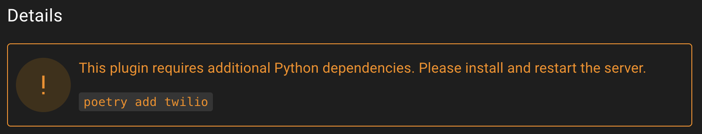

# Plugins

Plugins are an extension of Empire that allow for custom scripts to be loaded. This allows anyone to build or add community projects to extend Empire functionality.

## Installing Plugins

Plugin installation is available through the Starkiller **Plugin Marketplace**.

### Additional Dependencies

If a plugin requires additional Python dependencies, the plugin page will show a warning that the dependencies need to be installed before the plugin can be loaded.

